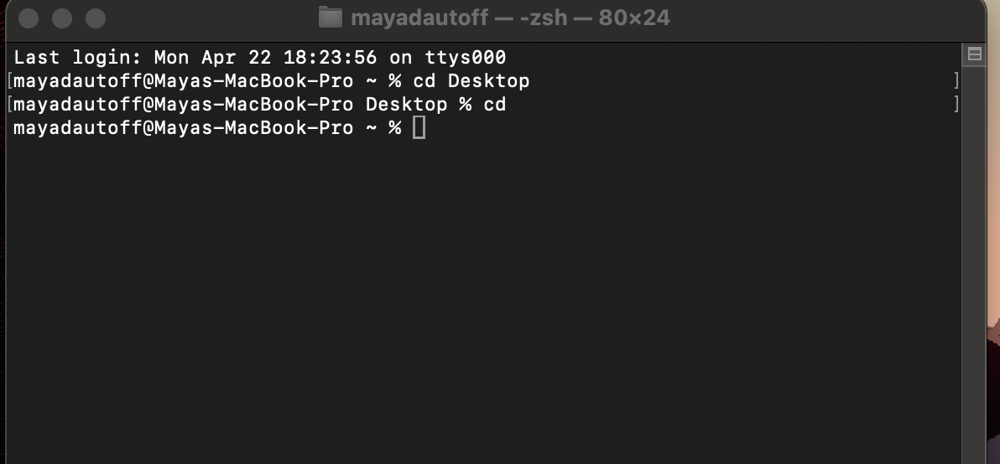
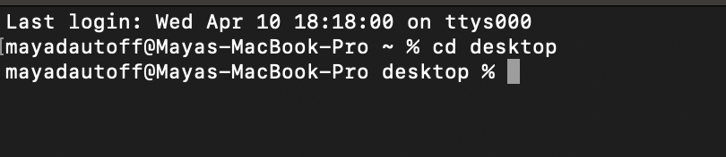
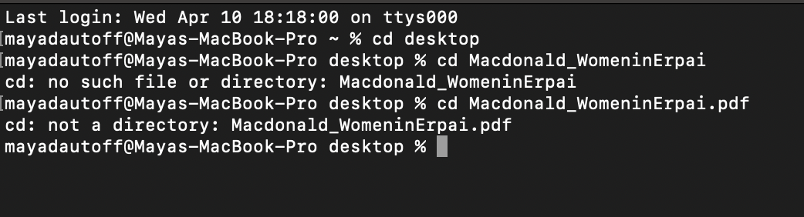
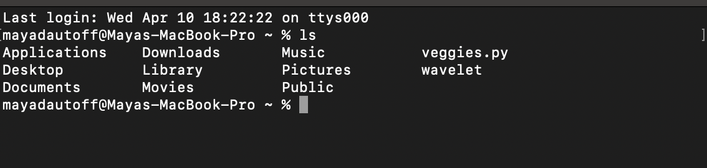
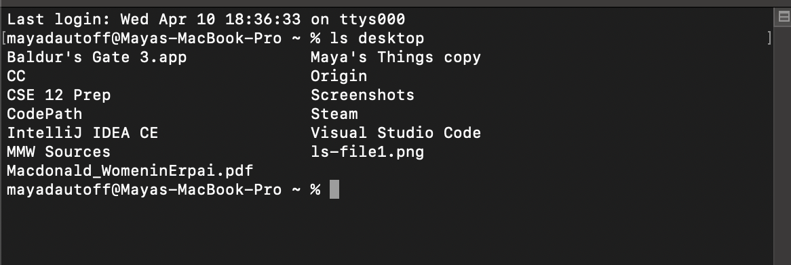
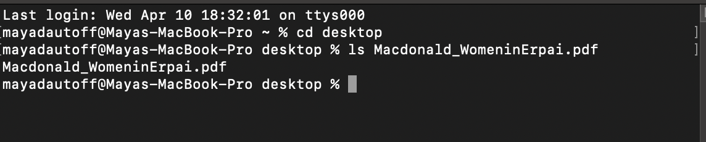
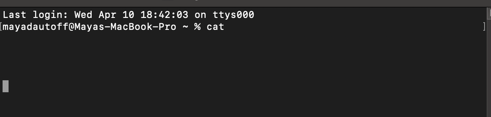
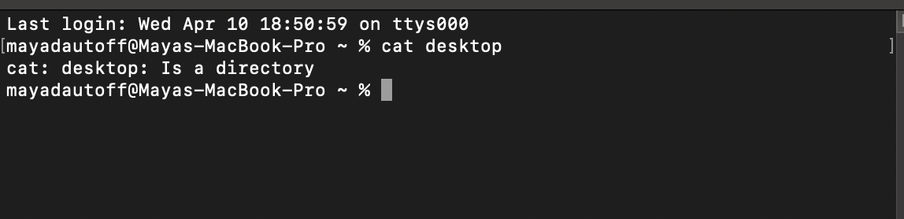
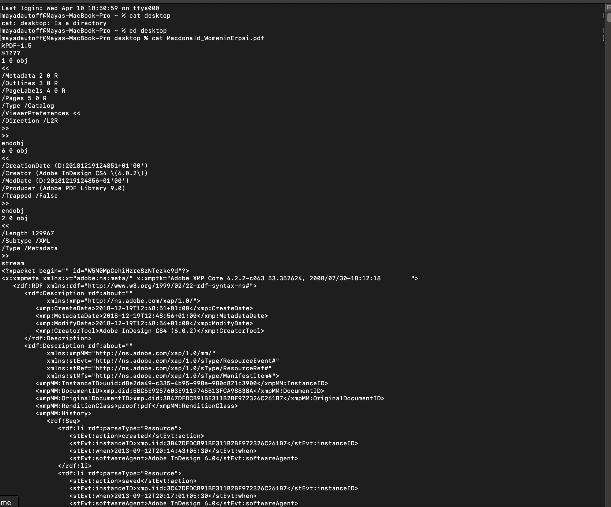

Name: Maya Dautoff

PID: A15512320

***

Hello, welcome to my first lab report! 

In this lab report, I will be showing what happens when I use the `cd`, `ls`, and `cat` commands with different arguments.

***

#### Using `cd` with no argument:

The absolute path to the working directory is right before the command was run: `/home/Desktop`.

I got this output because without a direction of a place to go to, `cd` changes to home directory.

It is not an error. 

#### Using `cd` with a path to a directory:

The absolute path to the working directory is right before the command was run: `/home`.

I got this out because `cd` was working correctly. It changed the directory from `/home` to `/home/desktop`. 

It is not an error and working properly. 

#### Using `cd` with a path to a file:

The absolute path to the working directory is right before the command was run: `/home/desktop/`.

I got this output because `cd` takes a directory as an argument and a file is not a directory. 

It resulted in an error because a file was used as an argument as opposed to a directory.

***

#### Using `ls` with no argument:

The absolute path to the working directory is right before the command was run: `/home`.

I got this output because terminal received the directions to list files, and it listed all the folders in home. 

This was not an error.

#### Using `ls` with a path to a directory:

The absolute path to the working directory is right before the command was run: `/home/desktop/`.

I got this output because terminal received the directions to list files and it listed everything in desktop.

This was not an error.

#### Using `ls` with a path to a file:

The absolute path to the working directory is right before the command was run: `/home/desktop/`.

I got this output because terminal received the directions to list files and it listed everything within one file, which was simply that file.

This was not an error. 

***

#### Using `cat` with no argument:

The absolute path to the working directory is right before the command was run: `/home`.

`cat` displays files onto the screen in the terminal, with no argument to read, it provides an opportunity for you to type something in, and then prints that. 

This is not an error. 

#### Using `cat` with a path to a directory:

The absolute path to the working directory is right before the command was run: `/home`.

`cat` displays files onto the screen in terminal. Since the argument was not a file, it was unable to run.

This is an error because there was the incorrect argument type. 

#### Using `cat` with a path to a file:

The absolute path to the working directory is right before the command was run: `/home/desktop`.

I got this output because `cat` displayed the contents of the file onto the screen.

This is not an error

***

