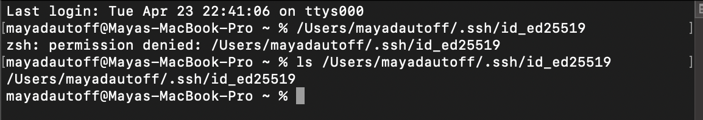

## Lab Report 2

Name: Maya Dautoff

PID: A15512320

*** 

#### Part One 

Code for the ChatServer:

Outputs of ChatServer
 

Which methods in your code are called?
The methods main and handlerequest are being called.

What are the relevant arguments to those methods, and the values of any relevant fields of the class?
The URL is the argument for `handlerequest` (http://localhost:4250/add-message?s=Hello&user=jpolitz) and an array of strings is the argument for `main`. 

How do the values of any relevant fields of the class change from this specific request? If no values got changed, explain why.
This specific request has the port number of 4250 which does not change. however the URL with the text changes to get different outputs. 

Which methods in your code are called?
The methods main and handlerequest are being called.

What are the relevant arguments to those methods, and the values of any relevant fields of the class?
The URL is the argument for `handlerequest` (http://localhost:4250/add-message?s=How%20are%20you&user=yash) and an array of strings is the argument for `main` (4250). 

How do the values of any relevant fields of the class change from this specific request? If no values got changed, explain why.
This specific request has the port number of 4250 which does not change. however the URL with the text changes to get different outputs. 

***
#### Part Two

Private Key

Public Key

Login to SSH

***
#### Part Three

One thing I learned from lab 2, I learned how to manipulate the URL to create different outputs. If you have the right code, the URL acts as input for the code. 
